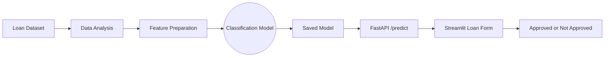
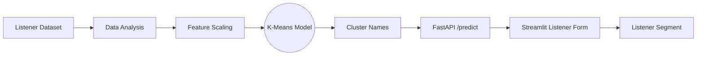

# Capstone Project

## Capstone Project Overview

This repository contains two machine learning applications developed as part of
the capstone project. The supervised project predicts loan approval, while the
unsupervised project groups music listeners into meaningful segments.


> Two practical machine learning applications using data analysis, trained
> models, FastAPI backends, and Streamlit frontends.

## Projects

### 1. Advanced Loan Approval Prediction

A supervised machine learning application that predicts whether a loan
application is approved using income, credit score, loan amount, and employment
years.

**Technologies:** Python, pandas, scikit-learn, joblib, FastAPI, Uvicorn,
Pydantic, Requests, and Streamlit.

**Flow:**

```text
Loan Dataset -> Data Analysis -> Model Training -> FastAPI Backend -> Streamlit Frontend -> Approval Result
```

Folder: `Supervised_Learning/ADV_LOAN_APPROVAL/`

### 2. Music Listener Segmentation

An unsupervised machine learning application that uses K-Means clustering to
group listeners according to listening hours, songs per day, skip rate, and
playlist count.

**Technologies:** Python, pandas, scikit-learn, joblib, K-Means, FastAPI,
Uvicorn, Pydantic, Requests, and Streamlit.

**Flow:**

```text
Listener Dataset -> Data Analysis -> Feature Scaling -> K-Means Clustering -> FastAPI Backend -> Streamlit Frontend -> Listener Segment
```

Folder: `Unsupervised_Learning/Music_Listener_Segmentation/`

## Tech Stack

| Layer | Technologies |
| --- | --- |
| Programming language | Python 3.x |
| Data processing | pandas, NumPy |
| Machine learning | scikit-learn |
| Supervised model | Loan approval classification models |
| Unsupervised model | K-Means clustering and feature scaling |
| Backend API | FastAPI, Uvicorn, Pydantic |
| Frontend | Streamlit |
| API integration | Requests, REST/JSON |
| Model persistence | Joblib and Pickle |
| Data visualization | Matplotlib and Seaborn |
| Collaboration | Git, GitHub, feature branches, and pull requests |

## Project Workflows

### Advanced Loan Approval Prediction



### Music Listener Segmentation



## Project Structure

```text
Capstone-Project/
├── README.md
├── Supervised_Learning/
│   ├── README.md
│   └── ADV_LOAN_APPROVAL/
│       ├── analysis/
│       │   └── Loan_Analysis1.ipynb
│       ├── data/
│       │   └── loans.csv
│       ├── graphs/
│       └── loan-approval-ml/
│           ├── app.py
│           ├── main.py
│           ├── requirements.txt
│           └── models/
├── Unsupervised_Learning/
│   ├── README.md
│   └── Music_Listener_Segmentation/
│       ├── analysis/
│       │   └── EDA.ipynb
│       ├── application/
│       │   ├── app.py
│       │   └── main.py
│       ├── data/
│       │   └── music_listeners (1).csv
│       ├── graphs/
│       └── ml model/
│           ├── train_model.ipynb
│           └── models/
└──
```

## Running the Applications

The detailed setup, backend, frontend, and test instructions are available in
the project-specific README files:

- [Supervised Learning README](Supervised_Learning/README.md)
- [Music Listener Segmentation README](Unsupervised_Learning/Music_Listener_Segmentation/README.md)


### Supervised ML — Advanced Loan Approval

#### Shyaam
1. Feature Engineering
2. ML Model Development
3. Model Evaluation
4. Integration & Final Testing

#### Harivarman
1. Data Collection & Dataset Preparation
2. EDA & Visualization
3. Data Cleaning
4. Data Preprocessing
6. Documentation

#### Harini
1. Backend Development
2. API Development
3. Web Application Development
4. Model–Backend Integration
5. Application Testing

---

### Unsupervised ML – Music Listener Segmentation

#### Shyaam
1. ML Model Development
2. Model Integration
3. Documentation
4. Final Testing

#### Sharmila D – Data
1. Data Cleaning
2. Preprocessing
3. EDA & Visualization
4. Feature Analysis

#### Sofianisha – ML
1. K-Means Model Development
2. Cluster Formation
3. Cluster Interpretation
4. Model Evaluation

#### Sai Aishwarya V – Application
1. Backend Development
2. Web Application Development
3. Model Integration
4. Application Testing
5. Documentation

---
